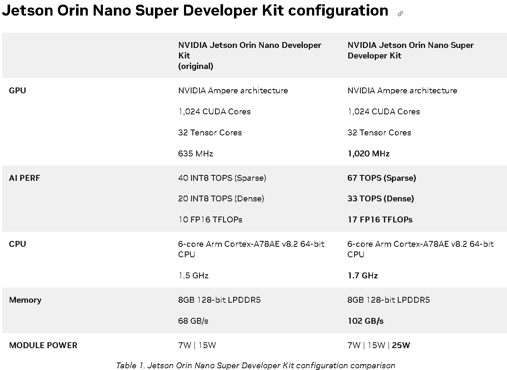

# jetson-orin-nano-super-benchmark-GPU

## REQUIREMENTS

*Hardware*
- Nvidia Jetson Orin Nano Super
- SSD NVME 128GB

*Software*
- Ubuntu 22.04 Jammy Jellyfish
- L4T 36.5.0
- Jetpack 6.2.2
- gcc 11.4.0
- GNU Make 4.3
- CMake 4.3.2
- Python 3.10.12

## BENCHMARK
#### cutclass_profiler
`. ./run_cutclass_profiler.sh`

*RESULT*
`Sparse GEMM + INT8` & `m=512 n=512 k=8192` give `32.142 TOPS` about `50% SOL`

`Sparse GEMM + FLOAT16` & `m=512 n=512 k=8192` give `19.283 TFLOPS` 

*EXPECTED*

#### ollama gemma3:4B
you can run ollama model on different PCs to compare the performance

`. ./run_ollama_gemma3-4b.sh`

